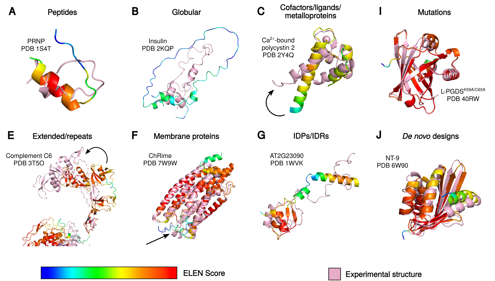

# ELEN - Equivariant Loop Evaluation Network

## Overview

In contemporary protein design, advanced machine learning algorithms generate novel amino acid sequences with unprecedented functionalities, such as enzymes with enhanced catalytic rates or new reactivities. These designed sequences are typically assessed *in silico* using deep learning-based protein structure prediction methods. While these models excel at predicting well-ordered regions, accurately modeling **loop regions**—which are often flexible and crucial for protein function—remains a significant challenge.

To address this, we introduce the **Equivariant Loop Evaluation Network (ELEN)**, a local model quality assessment (MQA) method tailored specifically for evaluating the quality of protein loops.

  

## Key Features

- ELEN predicts three distinct residue-level quality metrics by comparing predicted loops to reference crystal structures:
  - Local Distance Difference Test (lDDT)  
  - Contact Area Difference Score (CAD-score)  
  - Root Mean Squared Deviation (RMSD)  

- Operates as an all-atom model and uses **3D equivariant group convolutions** to capture the local geometric environment of each atom.

- Incorporates sequence embeddings from large protein language models such as Meta's **Evolutionary Scale Model 2 (ESM-2)** and **SaProt**, enhancing sequence and evolutionary context awareness.

- Integrates per-residue physicochemical features including solvent accessible surface area (SASA), Rosetta energy terms, and hydrogen bond counts.

- Demonstrates competitive or superior accuracy compared to state-of-the-art MQA methods on the Continuous Automated Model EvaluatiOn (CAMEO) benchmark dataset.

- Primarily designed for loop quality assessment but shows promise for broader residue-level quality evaluation tasks, including identifying flexible or disordered regions and assessing effects of single-residue mutations.

  

## Status and Availability

This project is currently in active development and pending publication. The source code, trained models, and datasets will be made publicly available upon official release.

## Contact

For inquiries, collaborations, or further information, please contact Florian Wieser.

---

*This repository serves as a public overview of the ELEN project. Detailed implementations will be shared once published.*
